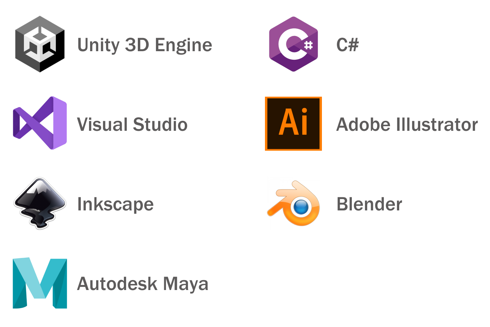
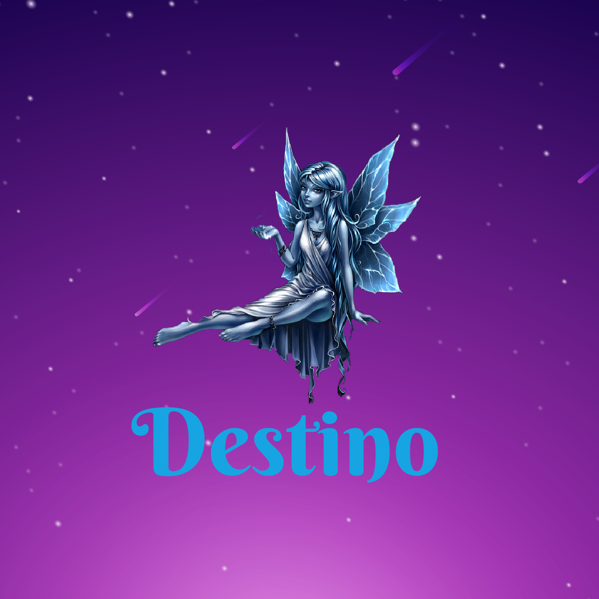
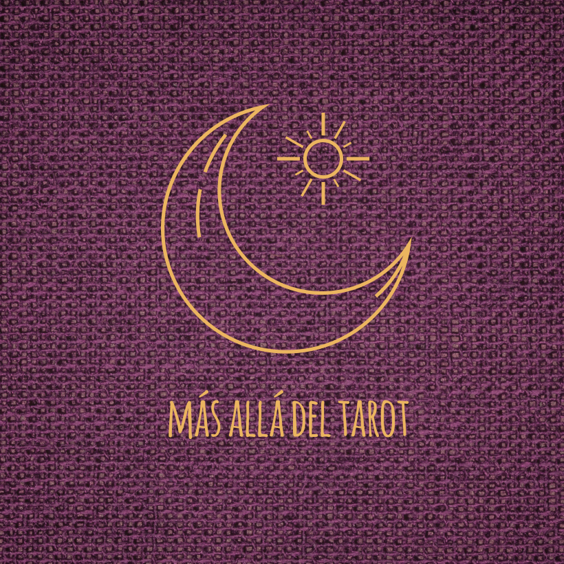
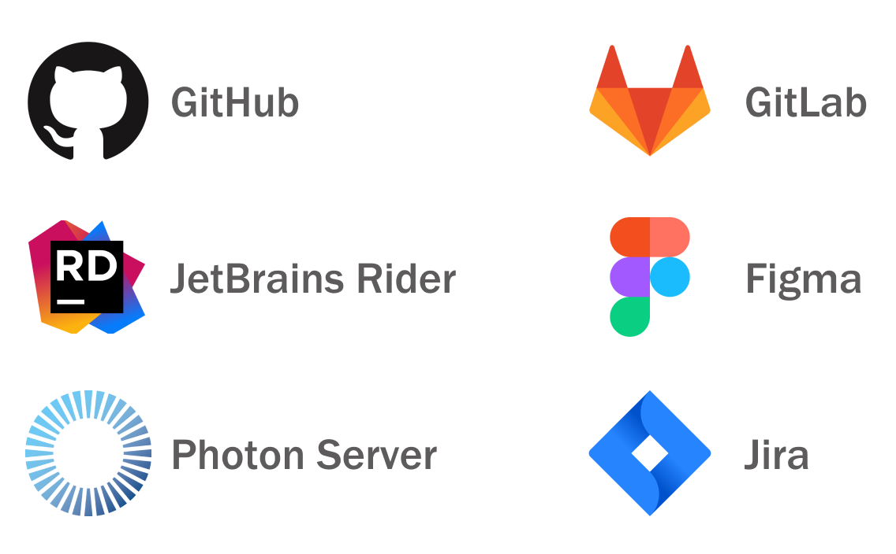

### Hi, I'm Cinthia. Welcome to my profile! :+1: -------------- [**Portfolio**](https://cinthiacuza.my.canva.site/) --------------- [**LinkedIn**](https://www.linkedin.com/in/cinthia-cuza-soca/)

#### :mortar_board: I graduated as computer engineer and my path in game development started during my time as student. 

#### 2014 :books:  My studies commenced at the Computing Sciences University in Cuba.  
#### 2017 :computer: I got my practical training in VERTEX, the center specialized in video games development. 
#### 2019 :video_game: I developed as my bachelor thesis the video game "The Wumpus world", based on artificial intelligence techniques. 

By then, I had the following **skills**: 

#### But then... What:interrobang:

#### 2019-2022 

- I worked as game developer and game designer creating video games for [**COSMOX**](https://apklis.cu/application/cu.vertex.cosmox), the Cuban multiplayer video game platform. I covered the entire development cycle of the games.

- I also got involved in some freelance projects :woman_technologist:  
   
   Game developer for the Spanish company Yoi Talent: [**Web game Destino**](http://centroesotericodestino.es/) 
   Game developer and game designer for Cubacitas social network: [**mobile game Domino**](https://cinthiacuza.itch.io/domino-cubacitas) 
   Game developer for the Spanish company Yoi Talent: **Web game Más allá del tarot**
   
      

#### 2023 Personal projects
- [**Minesweeper Game**](https://cinthiacuza.github.io/MinesweeperGame/)
  
These roles widened my range of **skills**: 

To know more about me please visit my [**Portfolio**](https://cinthiacuza.my.canva.site/) or my [**LinkedIn**](https://www.linkedin.com/in/cinthia-cuza-soca/) profile. :wave:
