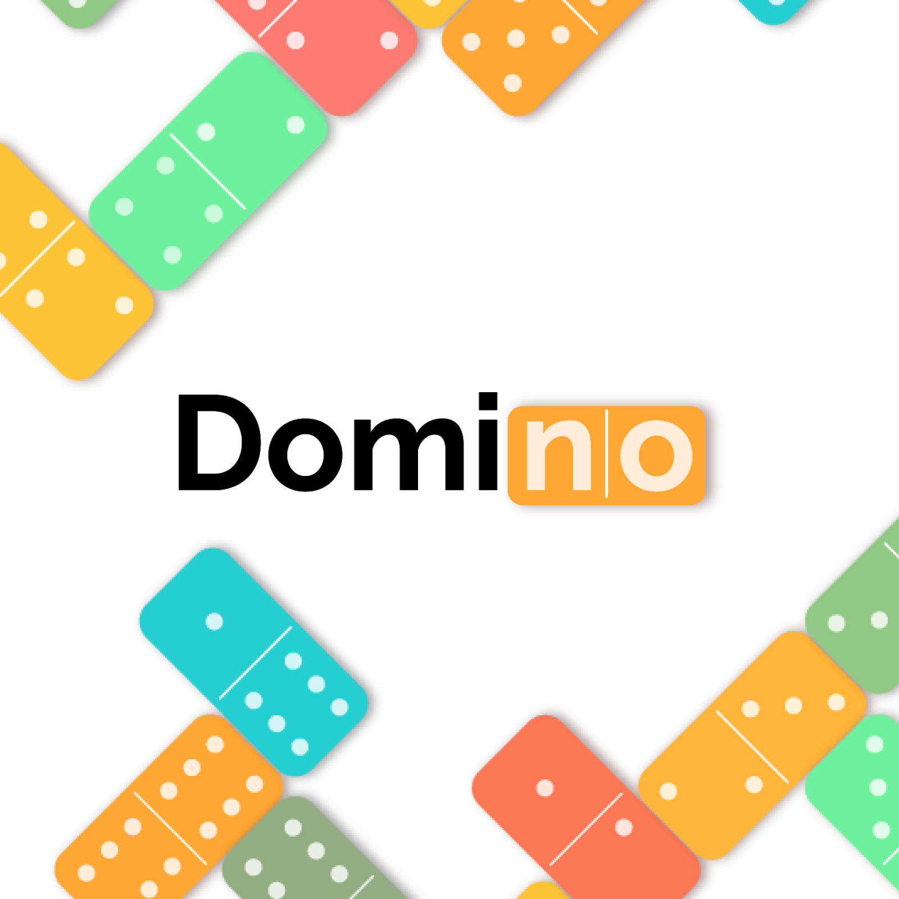

### Hi, I'm Cinthia. Welcome to my profile! :+1: 

#### :mortar_board: I graduated as a computer engineer, but my path in the game development world didn't start at that moment. 

:two::zero::one::three: I started my university studies at the Computing Sciences University in Cuba. :books:

:two::zero::one::seven: I started my practical studies in VERTEX, the center specialized in video games development. :computer:

:two::zero::one::nine: I presented as my bachelor thesis the video game "The Wumpus world", based on artificial intelligence techniques. :video_game:

By then, I already had **skills** in: 

#### But then... What:interrobang:

:two::zero::one::nine: - :two::zero::two::two: 

- I worked as a game developer and game designer creating video games for [**COSMOX**](https://apklis.cu/application/cu.vertex.cosmox), the Cuban multiplayer video game platform. I covered the entire development cycle of the games.

- I also got involve in some freelance works :woman_technologist:
   
   :two::zero::two::zero: Game developer for the Spanish company Yoi Talent: [**Web game Destino**](http://centroesotericodestino.es/)
   
   :two::zero::two::zero: - :two::zero::two::one: Game developer and game designer for Cubacitas social network: [**mobile game Domino**](https://cinthiacuza.itch.io/domino-cubacitas)
   
   :two::zero::two::one: Game developer for the Spanish company Yoi Talent: **Web game Más allá del tarot**
   
      

This allowed me to incorporate more **skills**: 

Don't hesitate to take a look of my [**Portfolio**](https://cinthiacuza.my.canva.site/) or my [**LinkedIn**](https://www.linkedin.com/in/cinthia-cuza-soca/) if you want to know more about me.
